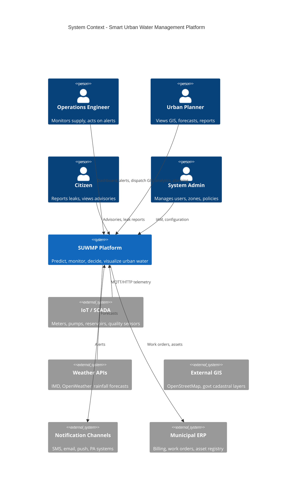
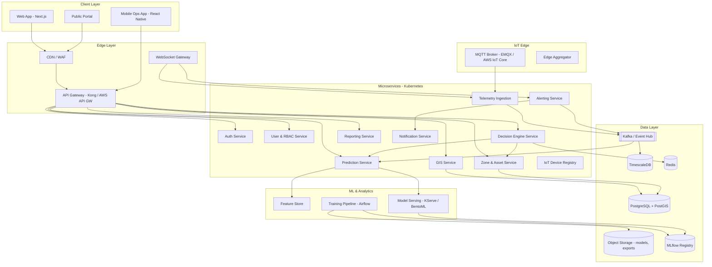
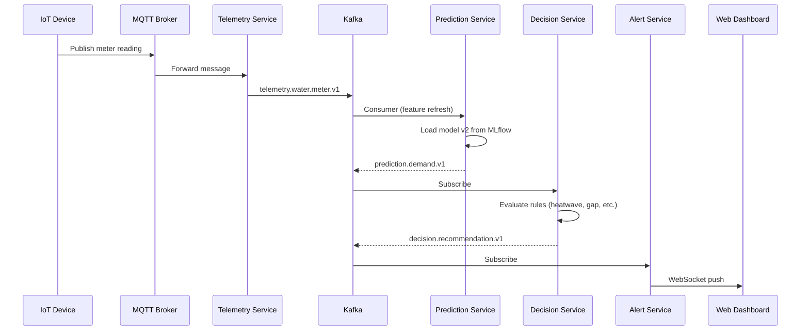
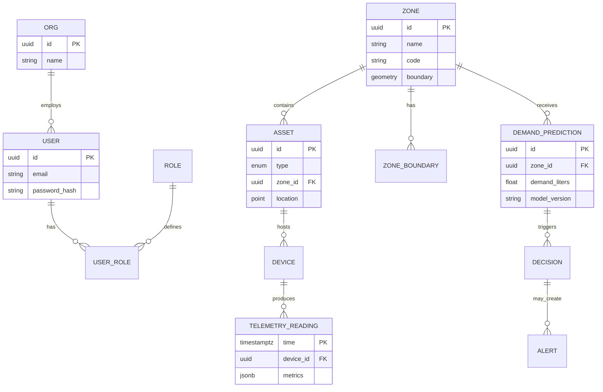
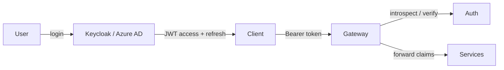
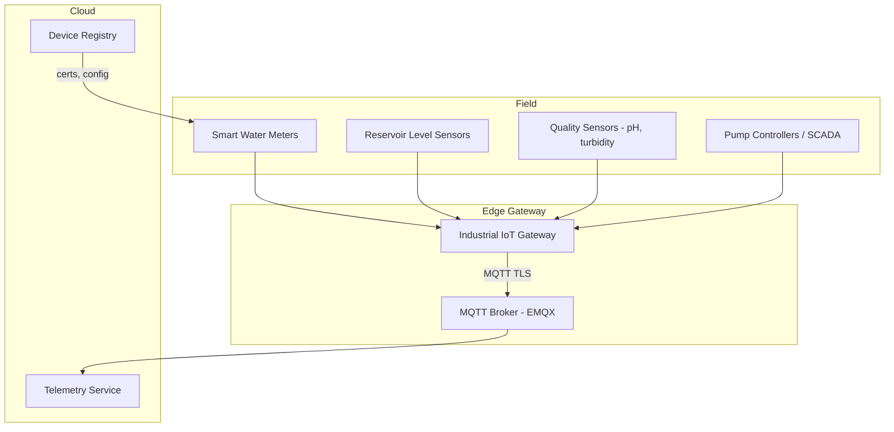
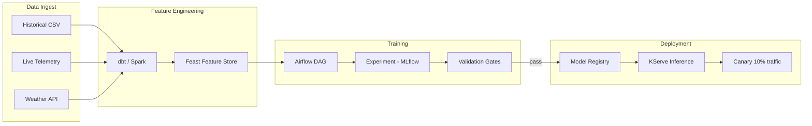
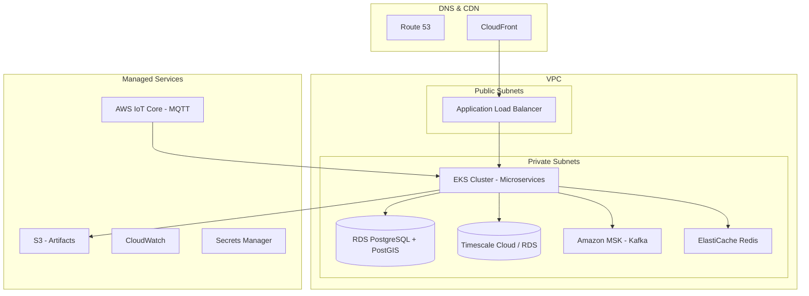

# Smart Urban Water Management Platform
## Enterprise Software Architecture

**Version:** 1.0  
**Status:** Architecture Blueprint  
**Evolution from:** AI Water Demand Prediction System (Streamlit + sklearn Random Forest)

---

## 1. Executive Summary

This document defines the target architecture for transforming the current proof-of-concept—a monolithic Streamlit app with a Random Forest regressor and rule-based `decision_engine()`—into an **enterprise-grade Smart Urban Water Management Platform (SUWMP)**.

| Current State | Target State |
|---------------|--------------|
| Single `dashboard.py` (Streamlit) | React/Next.js SPA + mobile ops app |
| No API layer | REST + GraphQL + WebSocket gateway |
| CSV + `.pkl` files | PostgreSQL + TimescaleDB + Redis + S3 |
| Batch sklearn training | MLOps pipeline (MLflow, Feast, online inference) |
| Manual inputs only | IoT telemetry + weather APIs + SCADA |
| Zone list in UI | PostGIS GIS layers + live map |
| Local `streamlit run` | Kubernetes on AWS/Azure/GCP |

---

## 2. System Context



---

## 3. High-Level Architecture



### 3.1 Architectural Principles

| Principle | Implementation |
|-----------|----------------|
| **Modular monorepo → polyrepo services** | Each bounded context is an independently deployable service with its own DB schema (schema-per-service where practical). |
| **Event-driven** | Telemetry and alerts flow through Kafka; services remain loosely coupled. |
| **API-first** | OpenAPI 3.1 specs per service; contract tests in CI. |
| **Zero-trust security** | mTLS between services, JWT at gateway, RBAC + ABAC for zone-scoped data. |
| **Observable** | OpenTelemetry traces, Prometheus metrics, structured logs (ELK/Loki). |
| **Cloud-native** | 12-factor apps, Helm charts, GitOps (Argo CD). |

---

## 4. Bounded Contexts & Microservices

### 4.1 Service Catalog

| Service | Responsibility | Tech Stack | Replaces / Extends |
|---------|----------------|------------|-------------------|
| **api-gateway** | Routing, rate limit, auth validation, request logging | Kong / AWS API Gateway | N/A (new) |
| **auth-service** | Login, OAuth2/OIDC, MFA, token issuance | Keycloak or custom (FastAPI + python-jose) | N/A |
| **user-service** | Profiles, roles, org units, audit | Node.js/NestJS or Go | N/A |
| **zone-asset-service** | Zones, reservoirs, pipelines, pump stations | FastAPI + PostGIS | Hard-coded zone list in `dashboard.py` |
| **telemetry-service** | Ingest, validate, normalize IoT payloads | Go or Python (async) + Kafka consumer | Manual sliders |
| **prediction-service** | Demand forecast API (sync + batch) | FastAPI + BentoML/KServe | `predict_water.py`, `train_model.py` inference |
| **decision-service** | Rule engine + policy DSL for recommendations | Python (rule engine) | `decision_engine()` in `dashboard.py` |
| **alert-service** | Thresholds, escalation, incident lifecycle | Node.js + Redis streams | Risk score logic |
| **gis-service** | Map tiles, layers, spatial queries, geofencing | GeoServer + PostGIS API | N/A |
| **report-service** | PDF/Excel exports, scheduled reports | Python + Celery | N/A |
| **notification-service** | SMS, email, push, webhook fan-out | Node.js + provider adapters | N/A |
| **iot-registry** | Device provisioning, certs, firmware metadata | FastAPI | N/A |

### 4.2 Inter-Service Communication



### 4.3 Preserving Current Business Logic

Your existing `decision_engine()` rules map directly to the **Decision Service** policy catalog:

| Current Rule (dashboard.py) | Enterprise Policy ID | Trigger |
|----------------------------|----------------------|---------|
| `gap <= 0` | `SUPPLY_SUFFICIENT` | predicted_demand ≤ supply |
| `rainfall < 5 and temperature > 35` | `HEATWAVE_ADVISORY` | Weather features |
| `industrial_index > 80 and gap > 200M` | `INDUSTRIAL_REDUCTION` | Zone industrial index |
| `rainfall > 20` | `RAINFALL_STORAGE` | Forecast rainfall |
| `gap > 500M` | `CRITICAL_SHORTAGE` | Supply gap |
| default | `MODERATE_SHORTAGE` | Else |

Risk score: `(gap / supply) * 100` → stored as metric `water_risk_score` in TimescaleDB for dashboards and alerting.

---

## 5. Frontend Architecture

### 5.1 Web Application (Primary)

| Layer | Choice | Rationale |
|-------|--------|-----------|
| Framework | **Next.js 14+** (App Router) | SSR for public portal, RSC for dashboards |
| Language | TypeScript | Type-safe API contracts |
| State | TanStack Query + Zustand | Server state vs UI state |
| UI | shadcn/ui + Tailwind CSS | Accessible, consistent ops UI |
| Maps | **Mapbox GL JS** or **Leaflet** + vector tiles from GIS service | Zone boundaries, assets, heatmaps |
| Charts | Apache ECharts or Recharts | Demand curves, reservoir levels |
| Real-time | Socket.io client or native WebSocket | Live telemetry & alerts |
| Auth | OIDC via **next-auth** or Auth0 SDK | SSO for municipal staff |

### 5.2 Module Structure (Feature-Based)

```
frontend/
├── apps/
│   ├── ops-dashboard/          # Internal operations
│   ├── planner-portal/         # GIS + analytics
│   └── public-portal/          # Advisories, conservation tips
├── packages/
│   ├── ui/                     # Shared components
│   ├── api-client/             # Generated from OpenAPI
│   ├── maps/                   # GIS wrappers
│   └── auth/                   # OIDC helpers
```

### 5.3 Key Screens

| Screen | Data Sources | Maps Current |
|--------|--------------|--------------|
| **Command Center** | Real-time KPIs, active alerts, zone risk heatmap | Streamlit title + metrics |
| **Demand Forecast** | Prediction API, historical series | Predict button + demand output |
| **Supply vs Demand** | Telemetry + predictions | Gap / risk score |
| **GIS Explorer** | PostGIS layers, pump/reservoir status | Zone selectbox |
| **Decision Log** | Decision service audit trail | Recommendation text |
| **IoT Device Manager** | IoT registry | N/A |
| **Model Performance** | MLflow metrics | Training R²/MAE prints |
| **Admin** | User/RBAC service | N/A |

### 5.4 Mobile Ops App (Phase 2)

React Native app for field crews: work orders, tanker dispatch, offline leak reports with GPS, photo upload to S3.

---

## 6. Backend Architecture

### 6.1 API Gateway

Single entry: `https://api.water.city.gov/v1`

| Concern | Implementation |
|---------|----------------|
| Authentication | Validate JWT (RS256), attach `X-User-Id`, `X-Roles`, `X-Zone-Scope` |
| Rate limiting | Per API key / per user tier |
| Versioning | URL path `/v1`, deprecation headers |
| Documentation | Aggregated OpenAPI via portal |

### 6.2 REST API Specification (Core)

#### Authentication

| Method | Path | Description |
|--------|------|-------------|
| POST | `/auth/token` | OAuth2 password or authorization code exchange |
| POST | `/auth/refresh` | Refresh access token |
| POST | `/auth/logout` | Revoke refresh token |
| GET | `/auth/me` | Current user profile |

#### Zones & Assets

| Method | Path | Description |
|--------|------|-------------|
| GET | `/zones` | List zones (paginated, GeoJSON optional) |
| GET | `/zones/{id}` | Zone detail + boundary |
| GET | `/assets` | Reservoirs, pumps, pipelines (filter by zone) |
| GET | `/assets/{id}/telemetry` | Historical readings |

#### Predictions (extends current ML)

| Method | Path | Description |
|--------|------|-------------|
| POST | `/predictions/demand` | **Sync forecast** — body mirrors current features |
| GET | `/predictions/demand/batch` | Batch job status |
| POST | `/predictions/demand/batch` | Schedule zone-wide forecast |
| GET | `/predictions/models` | List deployed model versions |

**POST `/predictions/demand` request (backward compatible with current model):**

```json
{
  "zone_id": "uuid-or-code",
  "population": 32000000,
  "temperature_c": 32,
  "rainfall_mm": 10,
  "industrial_index": 70,
  "forecast_date": "2026-05-24",
  "horizon_days": 1
}
```

**Response:**

```json
{
  "predicted_demand_liters": 4850000000,
  "model_version": "water-demand-rf-v2.1",
  "confidence_interval": { "lower": 4600000000, "upper": 5100000000 },
  "features_used": ["population", "temperature", "rainfall", "industrial_index", "month", "day", "zone_encoded"]
}
```

#### Decisions (extends `decision_engine`)

| Method | Path | Description |
|--------|------|-------------|
| POST | `/decisions/evaluate` | Input: prediction + supply + context → recommendation |
| GET | `/decisions/history` | Audit log with filters |

#### Telemetry & Monitoring

| Method | Path | Description |
|--------|------|-------------|
| POST | `/telemetry/ingest` | HTTP fallback for IoT (prefer MQTT) |
| GET | `/telemetry/metrics` | Aggregated time-series queries |
| GET | `/alerts` | Active alerts |
| PATCH | `/alerts/{id}` | Acknowledge / resolve |

#### GIS

| Method | Path | Description |
|--------|------|-------------|
| GET | `/gis/layers` | Available WMS/WFS/vector layers |
| GET | `/gis/features` | Spatial query (bbox, zone_id) |
| GET | `/gis/heatmap/demand` | Demand intensity grid |

### 6.3 GraphQL (Optional, Planner Portal)

Single endpoint `/graphql` for complex dashboard queries (zone + assets + latest telemetry + prediction in one round-trip).

### 6.4 WebSocket Channels

| Channel | Events |
|---------|--------|
| `/ws/alerts` | `alert.created`, `alert.resolved` |
| `/ws/telemetry/{zone_id}` | `meter.reading`, `reservoir.level` |
| `/ws/predictions` | `batch.completed` |

---

## 7. Database Architecture

### 7.1 Polyglot Persistence



### 7.2 Store Assignment

| Store | Technology | Data |
|-------|------------|------|
| **Operational DB** | PostgreSQL 16 + **PostGIS** | Users, zones, assets, devices, decisions, audit |
| **Time-series DB** | **TimescaleDB** (extension or dedicated) | Meter readings, reservoir levels, predictions, risk scores |
| **Cache** | Redis 7 | Session tokens, hot zone KPIs, rate limits |
| **Search** | OpenSearch (optional) | Incident search, log analytics |
| **Object storage** | S3 / Azure Blob | Model artifacts, reports, leak photos |
| **Message bus** | Apache Kafka | All domain events |

### 7.3 Migration from `delhi_water_dataset.csv`

| CSV Column | Target Table.Column |
|------------|---------------------|
| `date` | `telemetry_aggregate.day` or feature store event time |
| `zone` | `zone.name` → `zone_id` FK |
| `population` | `zone_demographics.population` or feature |
| `temperature`, `rainfall` | `weather_observations` / external API |
| `industrial_index` | `zone_features.industrial_index` |
| `water_demand` | `demand_actuals.demand_liters` (training label) |

### 7.4 Sample DDL (PostgreSQL + PostGIS)

```sql
CREATE EXTENSION IF NOT EXISTS postgis;

CREATE TABLE zone (
    id          UUID PRIMARY KEY DEFAULT gen_random_uuid(),
    code        VARCHAR(32) UNIQUE NOT NULL,
    name        VARCHAR(128) NOT NULL,
    boundary    GEOMETRY(MultiPolygon, 4326),
    population  BIGINT,
    created_at  TIMESTAMPTZ DEFAULT now()
);

CREATE TABLE asset (
    id          UUID PRIMARY KEY DEFAULT gen_random_uuid(),
    zone_id     UUID REFERENCES zone(id),
    asset_type  VARCHAR(32) NOT NULL, -- reservoir, pump, pipeline, treatment
    name        VARCHAR(128),
    location    GEOMETRY(Point, 4326),
    metadata    JSONB DEFAULT '{}'
);

-- Timescale hypertable (on telemetry DB)
CREATE TABLE telemetry_reading (
    time        TIMESTAMPTZ NOT NULL,
    device_id   UUID NOT NULL,
    metric      VARCHAR(64) NOT NULL,
    value       DOUBLE PRECISION,
    unit        VARCHAR(16),
    PRIMARY KEY (time, device_id, metric)
);
SELECT create_hypertable('telemetry_reading', 'time');
```

---

## 8. Authentication & Authorization

### 8.1 Identity Model



| Component | Technology |
|-----------|------------|
| Identity Provider | **Keycloak** (on-prem) or **Azure AD B2C** (cloud) |
| Protocol | OAuth 2.0 + **OpenID Connect** |
| Access token | JWT, 15 min TTL, RS256 |
| Refresh token | HttpOnly cookie or secure storage, rotation on use |
| Service-to-service | Client credentials + **mTLS** (Istio/Linkerd) |
| API keys | IoT devices (per-device cert or scoped API key) |

### 8.2 RBAC Roles

| Role | Permissions |
|------|-------------|
| `SUPER_ADMIN` | Full platform config |
| `CITY_ADMIN` | Users, zones, policies within city |
| `OPS_ENGINEER` | View all telemetry, acknowledge alerts, trigger decisions |
| `PLANNER` | Read-only GIS + analytics + exports |
| `FIELD_TECH` | Assigned work orders, limited telemetry |
| `PUBLIC` | Advisories, submit leak reports |
| `API_CLIENT` | Machine-to-machine (prediction batch jobs) |

### 8.3 ABAC (Zone Scoping)

Claims example: `"zone_scope": ["north-delhi", "central-delhi"]`  
PostgreSQL row-level security (RLS) enforces zone_id ∈ user scope.

---

## 9. IoT Integration Architecture

> **Detailed IoT design, sensor catalog, MQTT/Kafka specs, edge computing, and runnable implementation:**  
> See [IOT_ARCHITECTURE.md](./IOT_ARCHITECTURE.md) and `iot/` directory (`docker-compose.iot.yml`).  
> **GIS maps & routing:** [GIS.md](./GIS.md) — `dashboard_gis.py`, `gis/` package.  
> **AI assistant:** [ASSISTANT.md](./ASSISTANT.md) — `dashboard_assistant.py`, `assistant/` package.

### 9.1 Device Topology



### 9.2 Protocols & Payloads

| Protocol | Use Case |
|----------|----------|
| **MQTT 5.0** (primary) | High-volume meter readings |
| **CoAP** | Low-power sensors (optional) |
| **OPC-UA** | SCADA integration at treatment plants |
| **HTTP POST** | Legacy systems, webhook-style ingest |

**Topic convention:** `water/{city_id}/{zone_code}/{device_type}/{device_id}/telemetry`

**Payload schema (JSON, Avro in Kafka):**

```json
{
  "device_id": "meter-7f3a",
  "timestamp": "2026-05-24T10:30:00Z",
  "metrics": {
    "flow_rate_lpm": 42.5,
    "cumulative_volume_liters": 1284000,
    "pressure_bar": 3.2
  },
  "quality": "good"
}
```

### 9.3 Device Lifecycle

1. **Provision** — Register in IoT registry, issue X.509 cert  
2. **Configure** — OTA config: reporting interval, zone mapping  
3. **Ingest** — Validate schema, dedupe, write to TimescaleDB  
4. **Monitor** — Device heartbeat, last-seen alerts  
5. **Decommission** — Revoke cert, archive data  

---

## 10. Predictive Analytics & ML Pipeline

### 10.1 Evolution from Current Model

| Aspect | Current (`train_model.py`) | Target |
|--------|---------------------------|--------|
| Algorithm | RandomForestRegressor | RF baseline + **LightGBM** + optional **LSTM/Temporal Fusion Transformer** for multi-horizon |
| Features | 7 hand-picked | 50+ from Feature Store (lags, weather, holidays, events) |
| Training | Ad-hoc script | Scheduled **Airflow** DAG |
| Registry | `joblib` files | **MLflow** with staging → production |
| Serving | Loaded in Streamlit | **BentoML** or **KServe** behind prediction-service |
| Monitoring | None | Drift detection (Evidently AI), performance dashboards |

### 10.2 MLOps Pipeline



### 10.3 Feature Store (Feast)

| Feature Group | Features | Source |
|---------------|----------|--------|
| `zone_demographics` | population, industrial_index | PostgreSQL |
| `weather_daily` | temperature, rainfall, forecast | Weather API |
| `demand_lags` | demand_t-1, demand_t-7, rolling_mean_30d | TimescaleDB |
| `calendar` | month, day, is_holiday, day_of_week | Derived |
| `zone_static` | zone_encoded (learned embedding in v3) | Zone service |

**Online serving:** Redis-backed feature retrieval &lt; 10ms for real-time inference.

### 10.4 Training DAG (Airflow) — Weekly

1. Extract labels from `demand_actuals`  
2. Join offline features from Feast  
3. Train candidate models (RF, LightGBM)  
4. Evaluate: MAE, RMSE, MAPE per zone; must beat production baseline  
5. Register in MLflow; open PR for model promotion  
6. Deploy to staging → shadow mode → canary → full  

### 10.5 Decision Intelligence (Beyond ML)

| Layer | Method |
|-------|--------|
| **ML** | Demand forecast |
| **Rules** | Current `decision_engine` policies (YAML in Git) |
| **Optimization** | OR-Tools for tanker routing, pump scheduling (Phase 3) |
| **Simulation** | Digital twin what-if (Phase 4) |

---

## 11. GIS Visualization Architecture

### 11.1 Stack

| Component | Role |
|-----------|------|
| **PostGIS** | Store zone polygons, pipe networks, asset points |
| **GeoServer** | WMS/WFS map services |
| **Martin / pg_tileserv** | Vector tiles from PostGIS |
| **Mapbox GL / Leaflet** | Frontend rendering |
| **Deck.gl** (optional) | Large-scale heatmaps (demand, risk) |

### 11.2 Layers

| Layer ID | Geometry | Source | UI |
|----------|----------|--------|-----|
| `zones` | MultiPolygon | zone.boundary | Choropleth by risk score |
| `reservoirs` | Point | asset | Level %, status color |
| `pipeline_major` | LineString | asset | Maintenance status |
| `demand_heatmap` | Raster/hex grid | prediction-service | 24h forecast intensity |
| `alerts` | Point | alert-service | Pulsing markers |
| `iot_devices` | Point | iot-registry | Online/offline |

### 11.3 Spatial API Example

`GET /gis/features?layer=zones&bbox=77.0,28.4,77.4,28.8`  
→ GeoJSON FeatureCollection with properties `{ risk_score, predicted_demand, supply_gap }`

---

## 12. Real-Time Monitoring & Observability

### 12.1 Monitoring Stack

| Pillar | Tool |
|--------|------|
| **Metrics** | Prometheus + Grafana |
| **Logs** | Loki or ELK |
| **Traces** | Jaeger / Tempo (OpenTelemetry) |
| **Uptime** | Blackbox exporter, synthetic checks |
| **SLOs** | Prediction API p99 &lt; 500ms; telemetry ingest lag &lt; 30s |

### 12.2 Platform Dashboards (Grafana)

- **City Overview** — Total supply, demand, active alerts  
- **Zone Drill-down** — Per-zone gauges (replaces Streamlit metrics)  
- **IoT Health** — Devices offline, message rate  
- **ML Ops** — Model latency, error rate, drift score  

### 12.3 Alerting Flow

```
Telemetry threshold → alert-service → notification-service
Prediction risk_score > 80 → alert-service (severity: HIGH)
Decision policy CRITICAL_SHORTAGE → auto-create incident + SMS ops
```

---

## 13. Cloud Deployment Architecture

### 13.1 Reference: AWS (adaptable to Azure/GCP)



### 13.2 Kubernetes Layout

| Namespace | Workloads |
|-----------|-----------|
| `suwmp-prod` | All microservices, HPA 2–20 replicas |
| `suwmp-ml` | Model servers (GPU node pool optional) |
| `suwmp-data` | Kafka, Redis (if self-hosted) |
| `suwmp-monitoring` | Prometheus, Grafana agents |

### 13.3 CI/CD (GitOps)

```
GitHub → GitHub Actions (test, build image) → ECR
       → Argo CD sync → EKS
Helm charts per service; Kustomize overlays per environment (dev/staging/prod)
```

### 13.4 Environments

| Env | Purpose | Data |
|-----|---------|------|
| **dev** | Feature development | Synthetic + anonymized sample |
| **staging** | Integration, load test | Subset of production |
| **prod** | Live city operations | Full telemetry, encrypted at rest |

### 13.5 Security & Compliance

- Encryption: TLS 1.3 in transit, AES-256 at rest  
- Secrets: AWS Secrets Manager / Vault  
- Network: Private subnets, security groups, WAF on ALB  
- Compliance targets: ISO 27001 alignment, data residency (India region: `ap-south-1`)  
- Audit: Immutable audit log for decisions and admin actions  

---

## 14. Repository Structure (Target Monorepo)

```
smart-urban-water/
├── docs/
│   ├── ARCHITECTURE.md          # This document
│   ├── api/                     # OpenAPI specs per service
│   └── runbooks/
├── frontend/                    # Next.js apps (Section 5)
├── services/
│   ├── api-gateway/
│   ├── auth-service/
│   ├── user-service/
│   ├── zone-asset-service/
│   ├── telemetry-service/
│   ├── prediction-service/      # Wraps legacy RF → new models
│   ├── decision-service/        # Port of decision_engine
│   ├── alert-service/
│   ├── gis-service/
│   ├── report-service/
│   ├── notification-service/
│   └── iot-registry/
├── ml/
│   ├── pipelines/               # Airflow DAGs
│   ├── training/                # train_model.py evolved
│   ├── features/                # Feast definitions
│   └── serving/                 # BentoML bundles
├── infra/
│   ├── terraform/               # VPC, EKS, RDS
│   ├── helm/                    # Charts per service
│   └── docker/
├── legacy/                      # Current WATER project (reference)
│   ├── dashboard.py
│   ├── train_model.py
│   └── delhi_water_dataset.csv
└── docker-compose.yml           # Local dev stack
```

---

## 15. Phased Implementation Roadmap

| Phase | Duration | Deliverables |
|-------|----------|--------------|
| **0 — Foundation** | 2–3 weeks | Monorepo, Docker Compose (Postgres, Redis, Kafka), OpenAPI stubs, CI |
| **1 — API Core** | 4–6 weeks | prediction-service + decision-service (port existing logic), auth, PostgreSQL zones |
| **2 — Frontend MVP** | 4–6 weeks | Next.js Command Center + Demand Forecast (parity with Streamlit) |
| **3 — Real-time** | 3–4 weeks | Telemetry ingest, WebSockets, Grafana dashboards |
| **4 — IoT** | 4–6 weeks | MQTT broker, device registry, meter pilot |
| **5 — GIS** | 3–4 weeks | PostGIS boundaries, map UI, heatmaps |
| **6 — MLOps** | 4–6 weeks | Airflow, MLflow, Feast, model versioning, canary deploy |
| **7 — Cloud Prod** | 4–8 weeks | EKS, GitOps, HA, security hardening, DR |

---

## 16. Local Development Stack

`docker-compose.yml` services for laptop development:

| Service | Port | Image |
|---------|------|-------|
| PostgreSQL + PostGIS | 5432 | `postgis/postgis:16-3.4` |
| TimescaleDB | 5433 | `timescale/timescaledb:latest-pg16` |
| Redis | 6379 | `redis:7` |
| Kafka | 9092 | `confluentinc/cp-kafka` |
| Keycloak | 8080 | `quay.io/keycloak/keycloak` |
| MLflow | 5000 | `ghcr.io/mlflow/mlflow` |
| EMQX (MQTT) | 1883 | `emqx/emqx` |

Run legacy training: `python ml/training/train_model.py`  
Run new API: `uvicorn prediction_service.main:app --reload`

---

## 17. Non-Functional Requirements

| Requirement | Target |
|-------------|--------|
| Availability | 99.9% (prod API) |
| Prediction latency (p99) | &lt; 500 ms |
| Telemetry ingest | 100k events/sec (city-scale, horizontal scale) |
| RPO / RTO | 1 hour / 4 hours |
| Concurrent users | 500 ops users, 10k public portal |
| Data retention | Raw telemetry 2 years; aggregates 10 years |

---

## 18. Summary

This architecture transforms your **AI Water Demand Prediction System** into a modular, cloud-native **Smart Urban Water Management Platform** by:

1. **Decomposing** the monolithic Streamlit app into **12+ microservices** with clear bounded contexts.  
2. **Exposing** predictions and decisions via **versioned REST/WebSocket APIs** that preserve your current feature schema and rule logic.  
3. **Replacing** CSV/pickle persistence with **PostgreSQL/PostGIS**, **TimescaleDB**, and **Kafka**.  
4. **Integrating** **IoT telemetry** over MQTT alongside weather and SCADA data.  
5. **Operationalizing ML** with **Feast**, **Airflow**, **MLflow**, and **KServe** while keeping Random Forest as the baseline.  
6. **Visualizing** operations on **GIS maps** with zone risk heatmaps and asset layers.  
7. **Deploying** on **Kubernetes** with GitOps, full **observability**, and **OIDC authentication** with zone-scoped RBAC.

The existing `delhi_water_dataset.csv`, `train_model.py`, and `dashboard.py` `decision_engine()` remain the **semantic core** of Phase 1—wrapped in services, not discarded.

---

*Document maintained by Platform Architecture. For implementation tickets, derive epics from Section 15 (Roadmap).*
