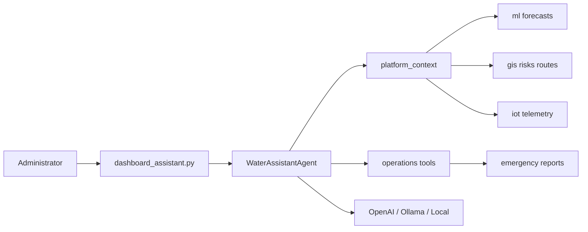

# AquaOps AI Assistant

LLM-powered operations assistant for the Smart Urban Water Management Platform (Delhi NCR).

## Capabilities

| Capability | How |
|------------|-----|
| **Operational Q&A** | Answers from live zone risks, supply, demand, IoT status |
| **Shortage summaries** | Per-zone gaps, risk levels, recommended actions |
| **Prediction explanations** | GRU/LSTM/Transformer forecasts with feature context |
| **Emergency reports** | Markdown incident briefings with tanker routes |
| **NL analytics** | Consumption share, anomalies, logistics overview |

## Quick start

```powershell
# Works immediately without API key (local analyst mode)
streamlit run dashboard_assistant.py

# CLI
python -m assistant.cli -i
python -m assistant.cli "Summarize water shortages"
python -m assistant.cli --report
```

## Enable full LLM (OpenAI)

```powershell
$env:OPENAI_API_KEY = "sk-..."
$env:OPENAI_MODEL = "gpt-4o-mini"   # optional
streamlit run dashboard_assistant.py
```

## Ollama (local LLM)

```powershell
ollama pull llama3.2
$env:OLLAMA_BASE_URL = "http://localhost:11434/v1"
$env:OLLAMA_MODEL = "llama3.2"
streamlit run dashboard_assistant.py
```

## Architecture



## Data sources

The assistant injects a live JSON snapshot into every LLM call:

- `gis.analytics.risk` — zone risk scores
- `gis.analytics.consumption` — 30-day consumption
- `ml.forecast` — 7-day GRU/LSTM/Transformer forecasts
- `ml/artifacts/training_results.json` — model metrics
- `ml/artifacts/analysis/anomaly_report.json` — anomalies
- `gis.routing.tanker_optimizer` — optimized routes
- IoT health endpoint (optional)

## Package layout

```
assistant/
├── agent.py              # Main orchestrator
├── config.py
├── context/
│   └── platform_context.py
├── tools/
│   └── operations.py
├── reports/
│   └── emergency.py
└── llm/
    ├── client.py
    ├── prompts.py
    └── fallback.py
```

## Emergency reports

Saved to `assistant/reports/output/emergency_YYYYMMDD_HHMMSS.md`

Includes: executive summary, zone risks, forecasts, actions, tanker plan, sign-off table.
