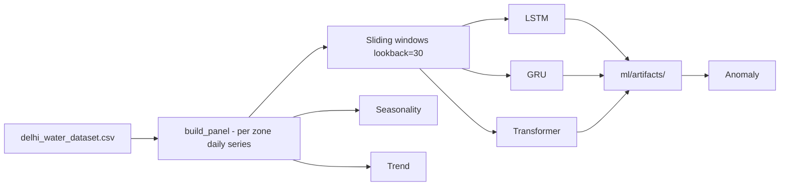

# Deep Learning Water Demand Forecasting

Upgrade from Random Forest tabular regression to **multivariate time-series forecasting** with LSTM, GRU, and Transformer models.

## Features

| Capability | Implementation |
|------------|----------------|
| **Multivariate forecasting** | Temperature, rainfall, industrial index, lags, cyclical time features, zone encoding |
| **LSTM / GRU / Transformer** | `ml/models/architectures.py` |
| **Multi-horizon** | Default 7-day ahead vector output |
| **Seasonality detection** | `seasonal_decompose` + ACF (`ml/analysis/seasonality.py`) |
| **Trend analysis** | Linear regression slope + rolling change (`ml/analysis/trend.py`) |
| **Anomaly detection** | Forecast residuals (95th pct) + Isolation Forest (`ml/analysis/anomaly.py`) |

## Quick start

```powershell
pip install -r requirements-ml.txt
python -m ml.train_deep
python -m ml.forecast --zone "North Delhi"
streamlit run dashboard_forecast.py
```

## Architecture



## Artifacts

| File | Description |
|------|-------------|
| `ml/artifacts/best_model.pt` | Best model by test MAE |
| `ml/artifacts/{lstm,gru,transformer}_model.pt` | Per-architecture checkpoints |
| `ml/artifacts/x_scaler.pkl`, `y_scaler.pkl` | StandardScaler for features/target |
| `ml/artifacts/training_results.json` | Test metrics comparison |
| `ml/artifacts/analysis/seasonality_report.json` | Per-zone seasonality |
| `ml/artifacts/analysis/trend_report.json` | Per-zone trends |
| `ml/artifacts/analysis/anomalies.csv` | Flagged points |

## Configuration

Edit `ml/config.py`:

- `LOOKBACK = 30` — input sequence length (days)
- `HORIZON = 7` — forecast horizon (days)
- `HIDDEN_SIZE`, `EPOCHS`, `BATCH_SIZE` — training hyperparameters

## Random Forest compatibility

Original scripts remain:

- `train_model.py` — Random Forest baseline
- `dashboard.py` — RF Streamlit UI

Deep learning dashboard: `dashboard_forecast.py`
