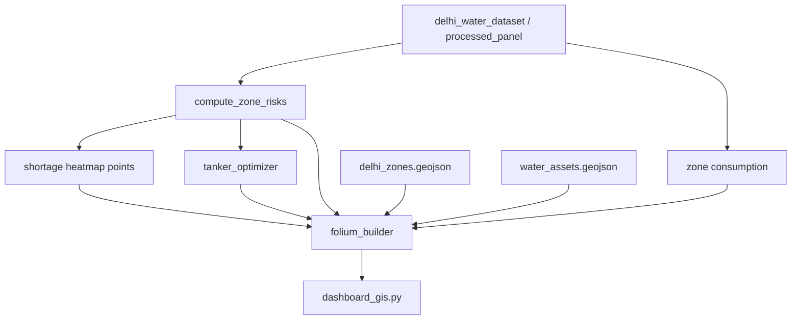

# GIS Integration — Smart Urban Water Management

Interactive geospatial analytics for Delhi NCR using **Folium** (Leaflet.js) with optional **Mapbox** tiles.

## Features

| Feature | Module | Map layer |
|---------|--------|-----------|
| **Shortage heatmap** | `gis/analytics/heatmap.py` | Weighted HeatMap by zone risk |
| **Zone consumption** | `gis/analytics/consumption.py` | Choropleth + consumption density |
| **Tanker route optimization** | `gis/routing/tanker_optimizer.py` | TSP routes (2-opt) on depots + priority sites |
| **Real-time risk monitoring** | `gis/analytics/risk.py` | Zone polygons colored by risk % |

## Quick start

```powershell
pip install -r requirements-gis.txt
streamlit run dashboard_gis.py
```

Optional Mapbox:

```powershell
$env:MAPBOX_TOKEN = "your_token"
# Select "mapbox" in dashboard sidebar
```

## Architecture



## Data files

| File | Content |
|------|---------|
| `gis/data/delhi_zones.geojson` | Zone polygons (5 Delhi zones) |
| `gis/data/water_assets.geojson` | Depots, reservoirs, pumps, priority hospitals |

## Risk score

Same formula as `dashboard.py` decision engine:

`risk_score = (demand - supply) / supply × 100`

| Level | Threshold |
|-------|-----------|
| Low | &lt; 15% |
| Medium | 15–40% |
| High | 40–70% |
| Critical | ≥ 70% |

## Tanker routing

1. Load depots and priority sites from `water_assets.geojson`
2. Add top-N high-risk zone centroids as delivery stops
3. Solve per-tanker TSP: nearest-neighbor + 2-opt (haversine km)
4. Draw `PolyLine` routes on map

## IoT integration

When telemetry API is running (`localhost:8080`), risk module can adjust supply from reservoir levels (extend `gis/analytics/risk.py`).

## Related dashboards

| App | Purpose |
|-----|---------|
| `dashboard.py` | Random Forest prediction |
| `dashboard_forecast.py` | Deep learning forecasts |
| `dashboard_gis.py` | **GIS maps & routing** |
