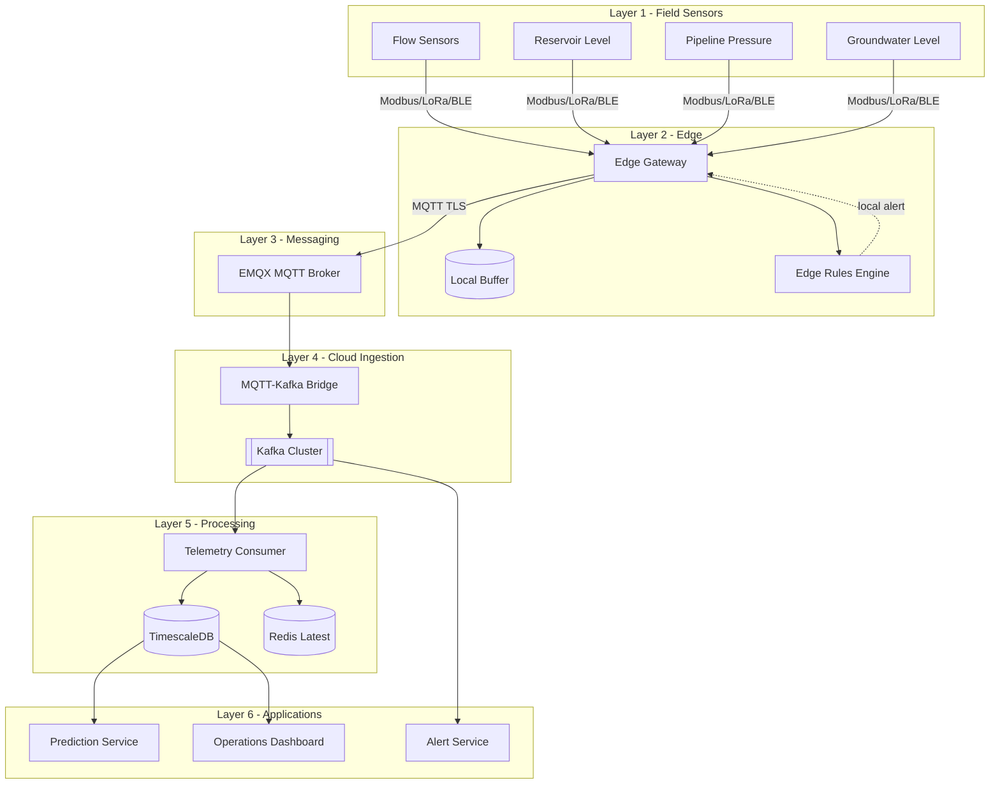
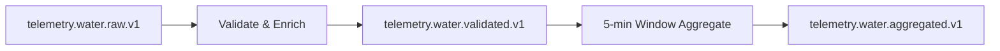
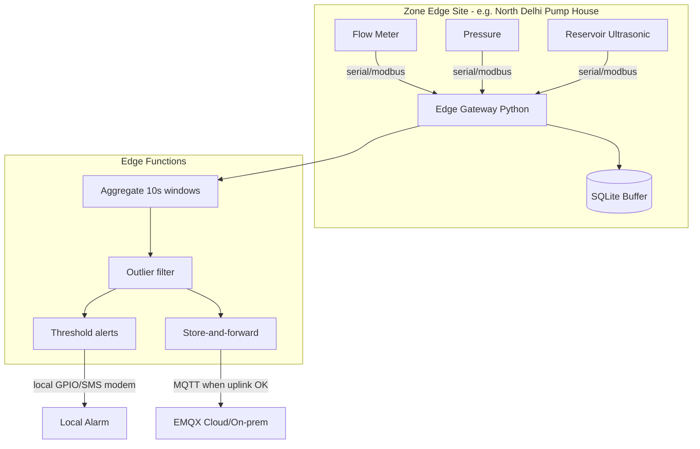
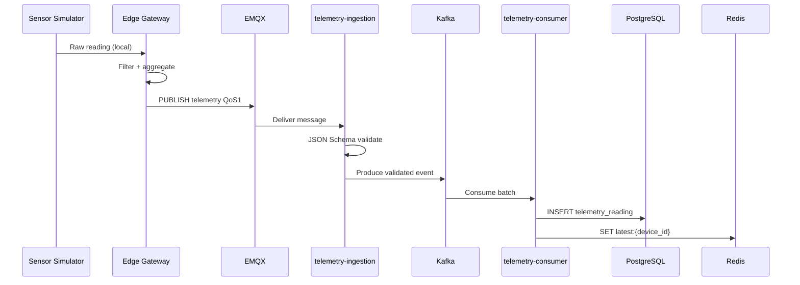
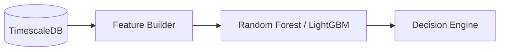

# IoT Architecture — Smart Urban Water Management Platform

**Version:** 1.0  
**Scope:** Flow meters, reservoir level, pipeline pressure, groundwater monitoring, MQTT → Kafka → cloud ingestion, edge computing.

Related: [ARCHITECTURE.md](./ARCHITECTURE.md) (platform-wide design)

---

## 1. Overview

The IoT layer connects **field sensors** to the **prediction and decision services** through a tiered pipeline:

| Tier | Location | Role |
|------|----------|------|
| **Device** | Pipe, reservoir, borewell | Measure flow, level, pressure, water table |
| **Edge** | Zone pump house / cabinet | Aggregate, filter, buffer, optional local alerts |
| **Transport** | MQTT broker (EMQX) | Secure pub/sub, device auth |
| **Ingestion** | `telemetry-ingestion` service | Validate, enrich, publish to Kafka |
| **Stream** | Kafka topics | Durable event bus for analytics & ML features |
| **Storage** | PostgreSQL / TimescaleDB | Time-series queries, dashboards |
| **Apps** | Streamlit / future API | Real-time ops views |



---

## 2. Sensor Catalog

### 2.1 Smart Water Flow Sensor

| Attribute | Value |
|-----------|--------|
| **Device type** | `flow_meter` |
| **Typical install** | DMA inlet, bulk meter, major distribution branch |
| **Metrics** | `flow_rate_lpm`, `cumulative_volume_liters`, `velocity_mps` |
| **Sampling** | 1–60 s (configurable at edge) |
| **Alerts** | Reverse flow, zero-flow during peak, burst above threshold |

```json
{
  "device_type": "flow_meter",
  "metrics": {
    "flow_rate_lpm": 1250.4,
    "cumulative_volume_liters": 894000000,
    "velocity_mps": 1.82
  }
}
```

### 2.2 Reservoir Monitoring Sensor

| Attribute | Value |
|-----------|--------|
| **Device type** | `reservoir_level` |
| **Install** | Raw water / service reservoirs |
| **Metrics** | `level_m`, `level_percent`, `volume_m3`, `inflow_lpm`, `outflow_lpm` |
| **Alerts** | Low level (&lt; 20%), rapid drawdown, overflow risk |

```json
{
  "device_type": "reservoir_level",
  "metrics": {
    "level_m": 12.4,
    "level_percent": 62.0,
    "volume_m3": 185000,
    "inflow_lpm": 3200,
    "outflow_lpm": 4100
  }
}
```

### 2.3 Pipeline Pressure Sensor

| Attribute | Value |
|-----------|--------|
| **Device type** | `pressure_sensor` |
| **Install** | Trunk mains, pump discharge, critical nodes |
| **Metrics** | `pressure_bar`, `pressure_kpa`, `differential_bar` (optional) |
| **Alerts** | Under-pressure (&lt; 1.5 bar service), over-pressure, sudden drop (leak signature) |

```json
{
  "device_type": "pressure_sensor",
  "metrics": {
    "pressure_bar": 3.45,
    "pressure_kpa": 345.0,
    "differential_bar": 0.12
  }
}
```

### 2.4 Groundwater Monitoring

| Attribute | Value |
|-----------|--------|
| **Device type** | `groundwater` |
| **Install** | Monitoring borewells, aquifer observation wells |
| **Metrics** | `water_table_m`, `drawdown_m`, `conductivity_us_cm`, `temperature_c` |
| **Alerts** | Water table below sustainable limit, rapid decline |

```json
{
  "device_type": "groundwater",
  "metrics": {
    "water_table_m": 28.6,
    "drawdown_m": 1.2,
    "conductivity_us_cm": 620,
    "temperature_c": 24.1
  }
}
```

---

## 3. MQTT Topic Hierarchy

```
water/
  {city_id}/                    # e.g. delhi-ncr
    {zone_code}/                 # north-delhi, south-delhi, ...
      {device_type}/             # flow_meter | reservoir_level | pressure_sensor | groundwater
        {device_id}/
          telemetry              # JSON payload (canonical)
          status                 # online, firmware, battery
          command                # downlink (config, OTA) — subscribed by device/edge
```

**Examples:**

| Topic | Publisher | Purpose |
|-------|-----------|---------|
| `water/delhi-ncr/north-delhi/flow_meter/FM-NRD-001/telemetry` | Edge / device | Flow readings |
| `water/delhi-ncr/central-delhi/reservoir_level/RSV-CTR-01/telemetry` | Edge | Reservoir level |
| `water/delhi-ncr/east-delhi/pressure_sensor/PRS-EAST-12/telemetry` | Edge | Pressure |
| `water/delhi-ncr/west-delhi/groundwater/GW-WEST-03/telemetry` | Edge | Aquifer level |

**QoS:** Telemetry `QoS 1` (at least once). Commands `QoS 2` where supported.

**Retain:** `status` messages retained; `telemetry` not retained.

---

## 4. Kafka Event Model

### 4.1 Topics

| Topic | Key | Partitions | Retention | Consumers |
|-------|-----|------------|-----------|-----------|
| `telemetry.water.raw.v1` | `device_id` | 12 | 7 days | Enrichment, dead-letter |
| `telemetry.water.validated.v1` | `device_id` | 12 | 30 days | DB writer, ML feature updater |
| `telemetry.water.aggregated.v1` | `zone_code` | 6 | 90 days | Dashboards, reporting |
| `alerts.water.iot.v1` | `zone_code` | 6 | 365 days | Alert service, SMS |

### 4.2 Message Envelope (validated topic)

```json
{
  "schema_version": "1.0",
  "event_id": "550e8400-e29b-41d4-a716-446655440000",
  "ingested_at": "2026-05-24T10:30:01.123Z",
  "device_id": "FM-NRD-001",
  "device_type": "flow_meter",
  "city_id": "delhi-ncr",
  "zone_code": "north-delhi",
  "timestamp": "2026-05-24T10:30:00Z",
  "metrics": { "flow_rate_lpm": 1250.4 },
  "quality": "good",
  "edge_gateway_id": "edge-north-01",
  "source_topic": "water/delhi-ncr/north-delhi/flow_meter/FM-NRD-001/telemetry"
}
```

### 4.3 Stream Processing (Phase 2+)



Implementation today: validate in `telemetry-ingestion`; aggregate in `telemetry-consumer` (optional rollups).

---

## 5. Edge Computing Architecture



### 5.1 Edge Responsibilities

| Function | Rationale |
|----------|-----------|
| **Protocol translation** | Modbus RTU → MQTT JSON |
| **Aggregation** | Reduce uplink 60:1 (1 Hz → 1 msg/min) |
| **Buffering** | Survive 24–72 h network outage |
| **Local rules** | Critical pressure drop → valve/pump interlock without cloud RTT |
| **Timestamping** | Device time + NTP sync flag |

### 5.2 Edge Gateway Implementation

Location: `iot/edge/gateway.py`

- Subscribes to local MQTT bus (optional) or polls simulators
- Applies `iot/edge/rules.py` (pressure &lt; 1.0 bar, reservoir &lt; 15%)
- Batches readings; publishes to cloud MQTT topic
- Persists unsent messages to `iot/edge/data/buffer.db`

---

## 6. Cloud Ingestion Pipeline



### 6.1 Service: `telemetry-ingestion`

| Item | Detail |
|------|--------|
| **Path** | `iot/services/telemetry_ingestion/` |
| **Input** | MQTT wildcard `water/+/+/+/+/telemetry` |
| **Output** | Kafka `telemetry.water.validated.v1` |
| **Failure** | Invalid payload → log + skip (optional DLQ topic) |

### 6.2 Service: `telemetry-consumer`

| Item | Detail |
|------|--------|
| **Path** | `iot/services/telemetry_consumer/` |
| **Input** | Kafka `telemetry.water.validated.v1` |
| **Output** | PostgreSQL hypertable, Redis latest values |
| **API** | FastAPI `/telemetry/latest`, `/telemetry/history` |

---

## 7. Database Schema (Telemetry)

See `iot/sql/init_telemetry.sql`.

| Table | Purpose |
|-------|---------|
| `iot_device` | Registry: id, type, zone, asset link |
| `telemetry_reading` | Hypertable: time, device_id, metric, value, unit |
| `telemetry_alert` | Edge/cloud triggered alerts |

---

## 8. Security

| Layer | Control |
|-------|---------|
| **Device → Edge** | Physical security, signed firmware |
| **Edge → MQTT** | TLS 1.2+, username/password or client cert per gateway |
| **MQTT ACL** | Device may only publish to own topic prefix |
| **Ingestion → Kafka** | SASL/SSL in production |
| **API** | JWT for human users; no public telemetry write |

**Dev mode:** EMQX allows anonymous on port 1883 (local only). **Never use in production.**

---

## 9. Integration with ML / Dashboard

| Data flow | Use |
|-----------|-----|
| Aggregated zone flow (15 min) | Replace manual demand sliders in `dashboard.py` |
| Reservoir `level_percent` | Supply availability for `decision_engine()` |
| Pressure trends | Leak detection features for ML |
| Groundwater `water_table_m` | Sustainability rules, emergency reserve activation |



---

## 10. Deployment Topology

### 10.1 Local Development (Docker Compose)

```bash
docker compose -f docker-compose.iot.yml up -d
pip install -r requirements-iot.txt
python iot/sql/apply_init.py   # or auto via compose
python iot/simulators/run_all.py
python iot/edge/gateway.py
python -m iot.services.telemetry_ingestion.main
python -m iot.services.telemetry_consumer.main
```

### 10.2 Production (Kubernetes)

| Component | K8s resource |
|-----------|--------------|
| EMQX | Helm chart / EMQX Operator |
| Kafka | Strimzi or MSK |
| telemetry-ingestion | Deployment HPA on MQTT lag |
| telemetry-consumer | Deployment HPA on consumer lag |
| Edge | Bare-metal / IoT Edge VM per zone (not in K8s) |

---

## 11. Observability

| Metric | Source |
|--------|--------|
| `mqtt_messages_received_total` | ingestion service |
| `kafka_produce_latency_ms` | ingestion |
| `telemetry_lag_seconds` | now() - event timestamp |
| `edge_buffer_depth` | gateway SQLite count |
| `devices_last_seen_stale` | Redis TTL miss &gt; 5 min |

---

## 12. File Map (Implementation)

```
iot/
├── README.md
├── config/
│   ├── devices.yaml          # Device registry (dev)
│   └── mqtt_acl.example      # EMQX ACL template
├── schemas/
│   └── telemetry_v1.json     # JSON Schema
├── edge/
│   ├── gateway.py            # Edge aggregator + buffer
│   └── rules.py              # Local threshold rules
├── simulators/
│   ├── base.py
│   ├── flow_sensor.py
│   ├── reservoir_sensor.py
│   ├── pressure_sensor.py
│   ├── groundwater_sensor.py
│   └── run_all.py
├── services/
│   ├── telemetry_ingestion/
│   └── telemetry_consumer/
└── sql/
    └── init_telemetry.sql
docker-compose.iot.yml
requirements-iot.txt
```

---

## 13. Alert Thresholds (Reference)

| Sensor | Condition | Severity | Action |
|--------|-----------|----------|--------|
| Flow | `flow_rate_lpm` &gt; 5000 for zone DMA | WARNING | Investigate burst |
| Reservoir | `level_percent` &lt; 20 | HIGH | Trigger pumping decision |
| Pressure | `pressure_bar` &lt; 1.5 | HIGH | Leak patrol, reduce demand |
| Pressure | drop &gt; 0.5 bar in 60 s | CRITICAL | Isolate segment |
| Groundwater | `water_table_m` &lt; policy min | HIGH | Restrict groundwater pumping |

These map to `iot/edge/rules.py` and future `alert-service` Kafka consumer.

---

*End of IoT Architecture Document*
