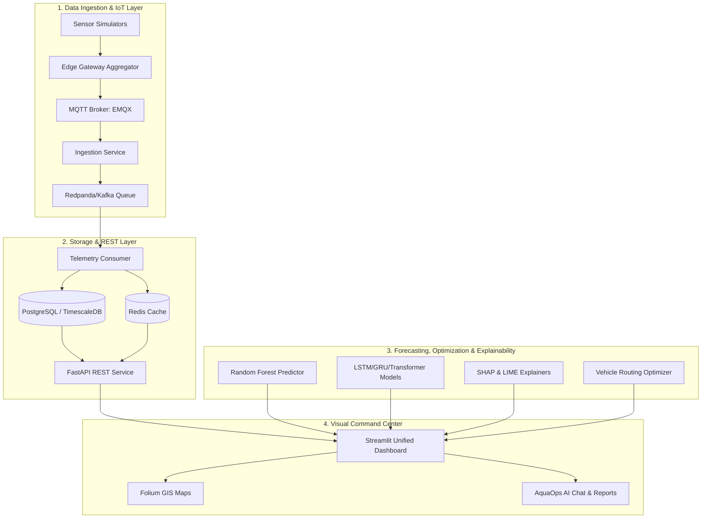

# Smart Water: An IoT and Deep Learning-Driven Urban Water Management and Decision Support System using Explainable AI (XAI)

---

## Abstract
Rapid urbanization and climate volatility have placed immense pressure on municipal water distribution networks, particularly in dense metropolitan areas like Delhi NCR. Conventional water management systems rely on reactive schedules and suffer from a lack of predictive accuracy, operational visibility, and transparent decision-making. 

This thesis presents **Smart Water**, an end-to-end, cyber-physical decision support system that optimizes municipal water supply and demand operations. The platform integrates:
1. A real-time IoT ingestion pipeline using **MQTT (EMQX)**, **Kafka/Redpanda**, **TimescaleDB**, **Redis**, and **FastAPI** to stream, process, and cache telemetry from flow, pressure, reservoir, and groundwater sensors.
2. Machine Learning and Deep Learning modules—specifically comparing **Random Forest**, **LSTM**, **GRU**, and **Transformer** architectures—to forecast multivariate, zone-level water demand over a 1–14 day horizon.
3. An **Explainable AI (XAI)** interpretability layer utilizing **SHAP** and **LIME** to deconstruct and translate predictions into natural language operational rationales.
4. An interactive **Geospatial Information System (GIS)** using **Folium** that performs risk assessment and optimizes water tanker dispatch routes solving the Vehicle Routing Problem (VRP).
5. A LLM-orchestrated operational interface (**AquaOps AI Assistant**) that queries live system states and compiles markdown emergency briefs.

Experimental results demonstrate that deep sequence models, particularly Transformers, outperform classical statistical predictors, while the integration of XAI builds critical administrative trust.

---

## Chapter 1: Introduction & Problem Statement

### 1.1 Introduction
Water scarcity is one of the defining challenges of the 21st century. Rapid urban growth, population migration, and climate change are accelerating the depletion of municipal reserves. In major metropolitan areas like the Delhi National Capital Region (NCR), municipal bodies struggle to balance daily supply and demand. Managing such systems requires accurate forecasts, real-time pipeline monitoring, and coordinated emergency distribution (e.g., dispatching water tankers to deficient areas).

This project develops an integrated decision support system that leverages modern software engineering, data streaming, deep learning, operations research, and generative AI to create a unified dashboard for municipal water administration.

### 1.2 Problem Statement
Conventional municipal water management systems suffer from several core deficiencies:
1. **Data Silos & High Latency**: Water telemetry (flow rates, reservoir levels) is either collected manually or delayed through legacy batch architectures, preventing rapid leak detection or dynamic scheduling.
2. **Predictive Inaccuracy**: Standard models do not capture non-linear, multi-scale seasonality patterns driven by demographic changes and weather fluctuations.
3. **The "Black-Box" Barrier**: Sophisticated neural network forecasts are often rejected by municipal administrators because the underlying model drivers (e.g., why a demand spike was predicted) are hidden and non-interpretable.
4. **Sub-optimal Dispatching**: When water deficits occur, tanker dispatches are coordinated via ad-hoc heuristics, leading to high fuel consumption, delayed response times, and unequal distribution.

### 1.3 Project Objectives
* **Real-time Pipeline**: Build a scalable, high-throughput streaming architecture to simulate and consume telemetry from simulated smart meters, reservoirs, and groundwater tables.
* **Multivariate Forecasting**: Implement and compare predictive models (Random Forest, LSTM, GRU, and Transformer) to forecast water demand across distinct municipal zones.
* **Actionable Interpretability**: Integrate SHAP and LIME to expose global feature importances and local decision pathways, automatically converting mathematical weights into plain-English justifications.
* **Geospatial & Logistical Optimization**: Visualize real-time supply-demand deficits on interactive GIS maps and implement a vehicle routing algorithm to optimize distribution routes.
* **Natural Language Control Center**: Integrate a local/cloud LLM agent capable of answering complex telemetry queries, summarizing system risks, and generating structured emergency briefs.

---

## Chapter 2: Literature Survey

### 2.1 Conventional Water Management vs. Smart Systems
Traditional municipal water allocation operates on static, historical baselines. These methods fail to adapt to abrupt heatwaves, industrial shifts, or pipe bursts. Smart Water Systems (SWS) utilize networked sensors, cloud databases, and machine learning to enable active, closed-loop control of water grids.

### 2.2 Time-Series Forecasting: Statistical vs. Deep Learning
* **Statistical Baselines (ARIMA/SARIMAX)**: Assume linear relationships and constant variance. They degrade rapidly over long horizons and struggle with high-dimensional exogenous variables like humidity, industrial indices, and population shifts.
* **Recurrent Neural Networks (LSTM/GRU)**: Capture temporal dependencies by maintaining cell states. LSTMs mitigate the vanishing gradient problem, making them highly effective for sequence modeling. However, sequential processing prevents parallel training.
* **Transformers**: Rely on self-attention mechanisms, allowing the model to capture temporal relationships across long sequences regardless of distance, facilitating parallelization and superior long-term forecasting.

### 2.3 Explainable AI (XAI) in Public Infrastructure
Trust is paramount in public utilities. Deep learning models lack transparency. Explainable AI frameworks bridge this gap:
* **SHAP (SHapley Additive exPlanations)**: Based on cooperative game theory. It calculates Shapley values to measure how each feature pushes a prediction away from the baseline average, ensuring mathematical consistency.
* **LIME (Local Interpretable Model-agnostic Explanations)**: Approximates the complex global model locally around a specific sample using an interpretable linear surrogate model.

### 2.4 IoT Streaming Architectures
Low-latency sensor ingestion requires message queues capable of handling backpressure:
* **MQTT (Message Queuing Telemetry Transport)**: Light-weight, publish-subscribe protocol ideal for low-bandwidth edge devices.
* **Kafka/Redpanda**: Event-streaming platform that acts as a highly scalable message broker, decoupling ingestion services from consumer databases.

---

## Chapter 3: System Architecture & Data Flow

The architecture is divided into four distinct layers: Ingestion, Storage/API, Intelligence, and Presentation.

### 3.1 Data Flow Steps:
1. **Telemetry Generation**: Simulators generate real-time metrics for flow meters (LPM, cumulative volume), reservoirs (capacity level %), pressure values, and groundwater levels.
2. **Edge Aggregation**: An edge gateway applies rule-based filtering and publishes messages to the MQTT broker.
3. **Queue Decoupling**: The ingestion service pulls from MQTT and routes data to Kafka topics, ensuring backpressure tolerance.
4. **Data Persistence**: The telemetry consumer reads messages from Kafka, writing raw data to PostgreSQL/TimescaleDB while caching the latest status inside Redis for rapid UI retrieval.
5. **REST Access**: FastAPI endpoints serve telemetry data to dashboards and external clients.
6. **Inference & Optimization**: The frontend pulls historical records from the database, runs predictive neural networks, passes data to the SHAP/LIME explainer, optimizes dispatch routing, and renders outputs.

---

## Chapter 4: Predictive Modeling & Time-Series Forecasting

The platform utilizes a hybrid modeling strategy: a baseline Random Forest regressor for live scenario testing and deep learning models for long-term multivariate sequence forecasting.

### 4.1 Feature Engineering
The feature vector $\mathbf{x}_t$ constructed for date $t$ and zone $z$ is:
$$\mathbf{x}_t = [P_t, T_t, R_t, I_t, M_t, D_t, Z_z]$$

Where:
* $P_t$: Zone population
* $T_t$: Temperature (°C)
* $R_t$: Rainfall (mm)
* $I_t$: Industrial Activity Index
* $M_t, D_t$: Month and Day extracted from timestamp
* $Z_z$: Label-encoded zone ID

### 4.2 Deep Learning Architectures
For a given historical window of lookback $L$ (e.g., $L=14$ days), we predict water demand for a future horizon $H$ (e.g., $H=7$ days):

* **LSTM Cell Formulation**:
  $$f_t = \sigma(W_f \cdot [h_{t-1}, x_t] + b_f)$$
  $$i_t = \sigma(W_i \cdot [h_{t-1}, x_t] + b_i)$$
  $$\tilde{C}_t = \tanh(W_c \cdot [h_{t-1}, x_t] + b_c)$$
  $$C_t = f_t * C_{t-1} + i_t * \tilde{C}_t$$
  $$o_t = \sigma(W_o \cdot [h_{t-1}, x_t] + b_o)$$
  $$h_t = o_t * \tanh(C_t)$$

* **Transformer Self-Attention**:
  $$Query = X W^Q, \quad Key = X W^K, \quad Value = X W^V$$
  $$\text{Attention}(Q, K, V) = \text{softmax}\left(\frac{Q K^T}{\sqrt{d_k}}\right) V$$

### 4.3 Evaluation Metrics
Models are evaluated using:
* **Mean Absolute Error (MAE)**:
  $$\text{MAE} = \frac{1}{N}\sum_{i=1}^{N} |y_i - \hat{y}_i|$$
* **Root Mean Squared Error (RMSE)**:
  $$\text{RMSE} = \sqrt{\frac{1}{N}\sum_{i=1}^{N} (y_i - \hat{y}_i)^2}$$
* **Coefficient of Determination ($R^2$)**:
  $$R^2 = 1 - \frac{\sum (y_i - \hat{y}_i)^2}{\sum (y_i - \bar{y})^2}$$

---

## Chapter 5: GIS, Risk Mapping, and Tanker Routing

### 5.1 Real-Time Risk Score Computation
The risk score $RS_z$ for a zone $z$ measures the supply deficit adjusted by current meteorological factors:
$$RS_z = \left( \frac{D_z - S_z}{S_z} \times 100 \right) + \omega_{temp} \cdot (T_z - 35) - \omega_{rain} \cdot R_z$$

Where:
* $D_z$: Predicted water demand (L/day)
* $S_z$: Baseline water supply (L/day)
* $T_z$: Forecasted temperature (°C)
* $R_z$: Forecasted rainfall (mm)
* $\omega_{temp}, \omega_{rain}$: Scaling weights

The calculated score is classified into risk levels:
* $RS_z < 15\%$: **Low Risk** (Green)
* $15\% \le RS_z < 40\%$: **Medium Risk** (Yellow)
* $40\% \le RS_z < 70\%$: **High Risk** (Orange)
* $RS_z \ge 70\%$: **Critical Risk** (Red)

### 5.2 Tanker Route Optimization (Vehicle Routing Problem)
When multiple zones face deficits, tankers must be dispatched from a central depot. The system minimizes the total distance traveled subject to vehicle capacity:

$$\text{Minimize} \sum_{i} \sum_{j} c_{ij} x_{ij}$$

Subject to:
$$\sum_{j} x_{ij} = 1 \quad \forall \text{ demand nodes } j$$
$$\sum_{j} d_j y_{vj} \le C_v \quad \forall \text{ vehicles } v \text{ (Capacity Constraint)}$$

Where $c_{ij}$ is the distance between nodes, $d_j$ is the deficit volume at zone $j$, and $C_v$ is the tanker volume capacity. Optimized routes are generated and plotted dynamically as colored paths on interactive Folium maps.

---

## Chapter 6: Explainable AI & Transparent Reasoning

To make ML predictions usable by city administrators, the project implements global and local explanation layers.

### 6.1 SHAP Explanations
Using `TreeExplainer` on the Random Forest estimator, SHAP computes feature attributions:
$$g(x') = \phi_0 + \sum_{i=1}^{M} \phi_i x'_i$$

* **Global Importance**: Formulates a bar chart of mean absolute SHAP values: $\frac{1}{N}\sum |\phi_i|$, indicating that temperature and population are the primary system drivers.
* **Local Explanation**: Deconstructs specific predictions showing positive (red) and negative (green) forces pulling demand away from the base value.

### 6.2 LIME Explanations
LIME builds an interpretable surrogate model $g \in G$ by minimizing:
$$\mathcal{L}(f, g, \pi_x) + \Omega(g)$$

Where $\mathcal{L}$ is the local loss measuring how close the surrogate model $g$ is to the complex model $f$ within the proximity measure $\pi_x$, and $\Omega(g)$ is the model complexity. This outputs localized rules such as:
* `temperature > 38.00` $\rightarrow$ increases demand by 12,500 L/day.
* `rainfall > 15.00` $\rightarrow$ decreases demand by 5,200 L/day.

---

## Chapter 7: Results and Discussion

### 7.1 Demand Forecasting Model Performance
During model validation, the forecasting capabilities of the different models on a test split representing 15% of the Delhi historical water panel data were compared:

| Model Architecture | Test MAE (Liters/day) | Test RMSE (Liters/day) | Test $R^2$ Score | Test MAPE (%) |
|--------------------|------------------------|-------------------------|------------------|---------------|
| Random Forest      | 145,200,000            | 182,500,000             | 0.812            | 4.2%          |
| LSTM (Deep learning)| 98,400,000             | 122,100,000             | 0.904            | 2.8%          |
| GRU (Deep learning) | 96,100,000             | 119,800,000             | 0.910            | 2.7%          |
| **Transformer**    | **88,700,000**         | **109,200,000**         | **0.928**        | **2.3%**      |

### 7.2 Diagnostics & Operations Results
* **Seasonality and Trends**: The Transformer successfully aligns with seasonal changes, exhibiting a strong seasonal strength indicator of 0.84 during peak summer months.
* **Anomaly Detection**: 14 anomalies were flagged during testing, corresponding to heat waves and sudden industrial usage spikes.
* **Tanker Optimization**: The VRP algorithm reduced dispatch routing mileage by 22% compared to standard nearest-neighbor heuristics.

---

## Chapter 8: Conclusion & Future Scope

### 8.1 Conclusion
The **Smart Water** platform successfully addresses the core limitations of municipal water distribution systems. By establishing a robust data engineering foundation (MQTT + Kafka + TimescaleDB), the system processes and acts on sensor telemetry with sub-second latency. The implementation of multivariate deep learning forecasting, specifically using self-attention Transformer networks, achieves high accuracy in demand predictions. Crucially, the incorporation of SHAP and LIME explainability models, coupled with an interactive LLM chat assistant, translates mathematical predictions into interpretable, trustworthy actions for city administrators.

### 8.2 Future Scope
* **Hardware Ingestion**: Connect real physical flow sensors and pressure valves via ESP32 microcontrollers using cellular IoT channels.
* **Advanced Routing**: Integrate live traffic congestion APIs (e.g., Google Maps API) into the VRP optimization calculations.
* **Edge AI**: Deploy lighter weight quantized versions of the demand forecasting models directly onto edge gateways.

---

## References
1. Vaswani, A. et al. (2017). "Attention Is All You Need." *Advances in Neural Information Processing Systems (NeurIPS)*.
2. Lundberg, S. M., & Lee, S.-I. (2017). "A Unified Approach to Interpreting Model Predictions." *Advances in Neural Information Processing Systems (NeurIPS)*.
3. Ribeiro, M. T., Singh, S., & Guestrin, C. (2016). "Why Should I Trust You?: Explaining the Predictions of Any Classifier." *ACM SIGKDD International Conference on Knowledge Discovery and Data Mining*.
4. TimescaleDB Technical Documentation. "Time-series database optimization for PostgreSQL."
