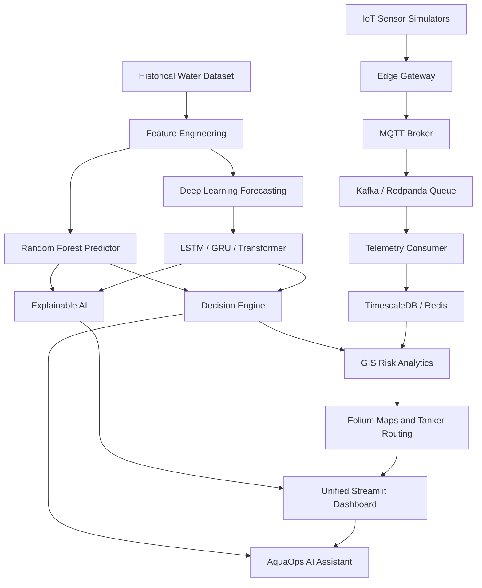

# Project Report

## Smart Water: IoT and Deep Learning Driven Urban Water Management and Decision Support System using Explainable AI

### Project Domain
Urban water demand forecasting, IoT monitoring, GIS-based risk analysis, and AI-assisted municipal decision support.

### Implementation Location
Delhi NCR water management simulation using historical and synthetic operational data.

---

## Abstract

Rapid urbanization, climate variability, and uneven resource distribution place major pressure on municipal water systems. Traditional water supply planning is often reactive and depends on static schedules, delayed reports, and manual decision-making. This project, **Smart Water**, presents an integrated decision support platform for urban water management.

The system combines machine learning, deep learning, IoT telemetry simulation, GIS visualization, explainable AI, and an AI operations assistant. It predicts zone-wise water demand, analyzes shortage risk, visualizes demand and supply gaps on maps, optimizes tanker dispatch routes, and provides natural-language operational summaries for administrators.

The implemented platform includes a Streamlit dashboard, Random Forest demand prediction, LSTM/GRU/Transformer-based deep learning forecasting, SHAP/LIME explainability, Folium GIS maps, MQTT/Kafka-style IoT architecture, and an AquaOps assistant for reports and operational queries. Experimental results show that the GRU model achieved the best saved deep learning performance in this project, with a test MAE of approximately 872,968 liters/day and an R2 score of 0.691.

---

## 1. Introduction

Water is a critical urban resource, and its efficient distribution is essential for public health, economic activity, and sustainable city planning. In large metropolitan regions such as Delhi NCR, demand varies across zones because of population density, temperature, rainfall, industrial activity, and seasonal patterns.

Conventional water management systems often face the following limitations:

- Demand estimation is based on historical averages instead of predictive analytics.
- Sensor data is either unavailable, delayed, or not integrated into a live decision platform.
- Machine learning predictions are difficult for administrators to trust without explanation.
- Emergency water tanker routing is often planned manually.
- Water shortage information is not always presented in a clear geospatial format.

This project addresses these limitations by developing a smart urban water management platform that combines predictive modeling, explainable AI, IoT telemetry, GIS analytics, and natural-language assistance.

---

## 2. Problem Statement

Municipal water departments need a reliable system to forecast water demand, monitor supply conditions, identify high-risk zones, and support fast operational decisions. Existing manual and rule-based methods do not adequately capture changing demand caused by weather, industrial usage, population growth, and seasonal variation.

The problem is to design and implement a system that can:

- Predict water demand for different Delhi NCR zones.
- Compare predicted demand with available supply.
- Detect shortage risk and recommend corrective actions.
- Explain model predictions in a human-understandable way.
- Visualize zone-level risks and routes using GIS maps.
- Simulate IoT sensor telemetry for real-time monitoring.
- Support administrators through an AI assistant and emergency reports.

---

## 3. Objectives

The main objectives of the project are:

1. Build a machine learning model to predict water demand using population, weather, industrial index, calendar fields, and zone information.
2. Develop deep learning time-series models for multi-day water demand forecasting.
3. Compare LSTM, GRU, and Transformer architectures using standard regression metrics.
4. Add explainable AI using SHAP and LIME to make predictions more transparent.
5. Design an IoT telemetry architecture for flow, pressure, reservoir, and groundwater sensors.
6. Build GIS-based maps for zone risk, consumption visualization, shortage heatmaps, and tanker routes.
7. Implement an AI assistant that can answer operational queries and generate emergency reports.
8. Provide a unified Streamlit dashboard for prediction, forecasting, GIS, XAI, and assistant modules.

---

## 4. Scope of the Project

The project is implemented as a prototype and simulation platform. It focuses on software design, data-driven forecasting, and decision support rather than deployment on physical municipal infrastructure.

### Included Scope

- Delhi NCR zone-wise demand dataset.
- Random Forest baseline demand prediction.
- Deep learning models: LSTM, GRU, and Transformer.
- Seven-day multi-horizon forecasting.
- GIS visualization using Folium and GeoJSON.
- IoT simulator architecture using MQTT, Kafka/Redpanda, PostgreSQL/TimescaleDB, Redis, and FastAPI.
- Explainable AI dashboards using SHAP/LIME concepts.
- AI assistant with local fallback mode and optional LLM integration.

### Excluded Scope

- Real physical sensor deployment.
- Production municipal SCADA integration.
- Live traffic API integration for tanker routing.
- Full cloud production deployment.

---

## 5. System Architecture

The Smart Water platform is organized into six major layers:

1. **Data Layer**: Historical Delhi water demand dataset and processed panel data.
2. **IoT Layer**: Simulated field sensors, edge gateway, MQTT broker, Kafka-style queue, telemetry consumer, database, and cache.
3. **Machine Learning Layer**: Random Forest prediction and deep learning forecasting.
4. **Explainability Layer**: SHAP and LIME based interpretation of model outputs.
5. **GIS Layer**: Zone risk maps, shortage heatmaps, consumption maps, and tanker route optimization.
6. **Presentation Layer**: Unified Streamlit dashboard and AquaOps AI assistant.



---

## 6. Dataset Description

The project uses `delhi_water_dataset.csv`, which contains 1,100 records of zone-wise water demand observations.

### Dataset Columns

| Column | Description |
|---|---|
| `date` | Observation date |
| `zone` | Delhi NCR zone name |
| `population` | Population value used as a demand feature |
| `temperature` | Temperature in Celsius |
| `rainfall` | Rainfall in millimeters |
| `industrial_index` | Industrial activity index |
| `water_demand` | Target water demand in liters |

### Sample Features

The model uses both raw and derived features:

- Population
- Temperature
- Rainfall
- Industrial activity index
- Month
- Day
- Zone encoding
- Time-series lag and sequence windows for deep learning

The deep learning pipeline builds a panel dataset and uses a 30-day lookback window to predict a 7-day demand horizon.

---

## 7. Methodology

### 7.1 Data Preprocessing

The preprocessing stage includes:

- Loading the CSV dataset.
- Encoding categorical zone names.
- Extracting calendar features from date.
- Scaling input features and target values for deep learning.
- Building sliding windows for sequence forecasting.
- Splitting data into training, validation, and testing sets.

The deep learning configuration uses:

| Parameter | Value |
|---|---|
| Lookback window | 30 days |
| Forecast horizon | 7 days |
| Training ratio | 70% |
| Validation ratio | 15% |
| Test ratio | 15% |
| Batch size | 32 |
| Epochs | 40 |
| Learning rate | 0.001 |
| Hidden size | 128 |

### 7.2 Random Forest Demand Prediction

The Random Forest model acts as a baseline predictor for scenario-based demand estimation. It uses tabular features such as population, temperature, rainfall, industrial index, month, day, and zone encoding.

Advantages of Random Forest:

- Handles non-linear relationships.
- Works well on tabular data.
- Provides stable baseline results.
- Supports SHAP-based tree explanations.

### 7.3 Deep Learning Forecasting

Three sequence models are implemented:

| Model | Purpose |
|---|---|
| LSTM | Captures long-term temporal dependencies using memory cells |
| GRU | Captures sequence patterns with fewer gates than LSTM |
| Transformer | Uses self-attention to model relationships across time steps |

The models forecast water demand for multiple future days and are stored as PyTorch artifacts in `ml/artifacts/`.

### 7.4 Explainable AI

Explainable AI is included to make predictions understandable to administrators.

SHAP is used to estimate the contribution of each feature to a prediction. LIME is used to explain individual predictions by creating a local interpretable approximation around one sample.

This helps answer questions such as:

- Did high temperature increase the predicted demand?
- Did rainfall reduce the demand estimate?
- Which feature had the strongest impact on a specific result?

### 7.5 GIS Risk Analysis

The GIS module uses Delhi zone boundaries and water asset data to show operational risk on interactive maps.

Main GIS functions include:

- Zone risk score calculation.
- Shortage heatmap generation.
- Consumption visualization.
- Tanker route optimization.
- Folium map rendering.

The risk score is based mainly on the demand-supply gap:

```text
risk_score = ((predicted_demand - available_supply) / available_supply) * 100
```

Risk levels are classified as:

| Risk Level | Threshold |
|---|---|
| Low | Less than 15% |
| Medium | 15% to 40% |
| High | 40% to 70% |
| Critical | 70% or above |

### 7.6 IoT Telemetry Architecture

The IoT module simulates real-time monitoring for:

- Flow meters
- Reservoir level sensors
- Pipeline pressure sensors
- Groundwater monitoring sensors

The proposed telemetry pipeline is:

```text
Sensor Simulator -> Edge Gateway -> MQTT Broker -> Kafka/Redpanda -> Telemetry Consumer -> TimescaleDB/Redis -> Dashboard/API
```

This architecture enables future real-time decision-making from live field measurements.

### 7.7 AI Assistant

The AquaOps AI Assistant provides a natural-language interface for operations staff. It can:

- Summarize water shortage risks.
- Explain predictions.
- Generate emergency reports.
- Answer zone-level operational questions.
- Use local fallback logic when no external LLM API key is configured.

---

## 8. Implementation Details

### 8.1 Main Technologies Used

| Area | Tools / Libraries |
|---|---|
| Programming language | Python |
| Dashboard | Streamlit |
| Machine learning | scikit-learn, joblib |
| Deep learning | PyTorch |
| Data processing | pandas, NumPy |
| Explainability | SHAP, LIME |
| GIS | Folium, GeoJSON |
| IoT messaging design | MQTT, EMQX, Kafka/Redpanda |
| API design | FastAPI |
| Storage design | PostgreSQL, TimescaleDB, Redis |
| Assistant | Local fallback, optional OpenAI/Ollama-compatible LLM |

### 8.2 Important Project Files

| File / Folder | Purpose |
|---|---|
| `dashboard.py` | Unified Streamlit dashboard |
| `delhi_water_dataset.csv` | Main dataset |
| `train_model.py` | Random Forest training |
| `predict_water.py` | Demand prediction script |
| `decision_engine.py` | Recommendation logic |
| `ml/` | Deep learning forecasting package |
| `ml/artifacts/` | Trained deep learning models and metrics |
| `gis/` | GIS analytics and map generation |
| `iot/` | IoT simulators, edge gateway, schemas, and services |
| `assistant/` | AquaOps assistant and report generation |
| `xai/` | Explainability layer |
| `docs/` | Architecture and module documentation |

---

## 9. Results

The saved deep learning training results are:

| Model | Test MAE (liters/day) | Test RMSE (liters/day) | R2 Score | MAPE (%) |
|---|---:|---:|---:|---:|
| LSTM | 1,151,707.28 | 1,577,549.17 | 0.5227 | 0.0239 |
| GRU | 872,967.87 | 1,269,536.25 | 0.6909 | 0.0181 |
| Transformer | 1,127,817.20 | 1,503,388.73 | 0.5665 | 0.0234 |

The best saved model is:

```text
GRU
```

### Result Interpretation

The GRU model achieved the lowest MAE and RMSE among the saved deep learning models. It also achieved the highest R2 score. This indicates that the GRU architecture performed best for the current dataset and configuration.

The Transformer model performed better than LSTM in R2 but did not outperform GRU. This may be due to the dataset size, training configuration, or limited sequence complexity. Transformers generally require larger datasets and tuning to fully outperform recurrent models.

---

## 10. Dashboard Modules

The unified dashboard provides the following modules:

| Module | Function |
|---|---|
| Overview | Displays platform status and zone risk summaries |
| Demand Prediction | Predicts demand using the Random Forest model |
| Explainable AI | Shows SHAP/LIME-based reasoning |
| Deep Learning Forecast | Displays LSTM, GRU, and Transformer forecasts |
| GIS Maps | Shows zone maps, risk heatmaps, consumption, and routes |
| AI Assistant | Provides natural-language operational support |

The dashboard can be started with:

```powershell
python -m streamlit run dashboard.py
```

---

## 11. Decision Support Logic

The decision engine compares predicted demand with available water supply and contextual weather/industrial conditions. It generates recommendations such as:

- Supply is sufficient.
- Increase allocation during shortage.
- Activate emergency tanker dispatch for critical shortage.
- Store water during high rainfall conditions.
- Apply industrial usage control during high industrial demand.
- Issue heatwave advisory when temperature is high and rainfall is low.

This converts model output into actionable administrative guidance.

---

## 12. Advantages of the Proposed System

- Provides data-driven water demand forecasting.
- Supports multi-day planning through deep learning.
- Improves trust using explainable AI.
- Enables geospatial understanding of shortage risk.
- Supports future real-time monitoring through IoT architecture.
- Helps administrators through an AI assistant.
- Combines prediction, visualization, routing, and reporting in one platform.

---

## 13. Limitations

- The dataset is limited and appears to be synthetic or simulation-oriented.
- Real municipal deployment would require verified live sensor data.
- Physical IoT devices are not connected in the current prototype.
- Weather API integration is optional and depends on API keys.
- Tanker routing uses simplified geographic optimization and does not include live traffic.
- Model accuracy may improve with larger historical datasets and hyperparameter tuning.

---

## 14. Future Scope

Future improvements can include:

- Integration with real flow meters, pressure sensors, and reservoir sensors.
- Use of live weather and rainfall forecasts from official APIs.
- Deployment of the telemetry pipeline using production MQTT and Kafka services.
- Addition of live traffic data for tanker route planning.
- Model monitoring using MLflow and drift detection.
- Cloud deployment using Docker, Kubernetes, and managed databases.
- Mobile application for field engineers and tanker operators.
- Integration with municipal ERP, billing, and complaint systems.

---

## 15. Conclusion

The Smart Water project demonstrates a complete prototype for intelligent urban water management. It combines machine learning, deep learning, IoT architecture, explainable AI, GIS visualization, and an AI assistant into a unified decision support platform.

The system can predict zone-wise demand, identify shortage risks, explain predictions, visualize affected regions, and support emergency planning. Based on the saved training results, the GRU deep learning model achieved the best forecasting performance among LSTM, GRU, and Transformer models.

Overall, the project shows how modern AI and data engineering methods can improve the planning, monitoring, and operational response capabilities of municipal water management systems.

---

## References

1. Vaswani, A. et al. (2017). Attention Is All You Need. Advances in Neural Information Processing Systems.
2. Lundberg, S. M. and Lee, S.-I. (2017). A Unified Approach to Interpreting Model Predictions. Advances in Neural Information Processing Systems.
3. Ribeiro, M. T., Singh, S., and Guestrin, C. (2016). Why Should I Trust You? Explaining the Predictions of Any Classifier. ACM SIGKDD.
4. scikit-learn documentation: Random Forest Regressor.
5. PyTorch documentation: Recurrent neural networks and Transformer modules.
6. Folium documentation: Python wrapper for Leaflet maps.
7. TimescaleDB documentation: Time-series data management on PostgreSQL.

